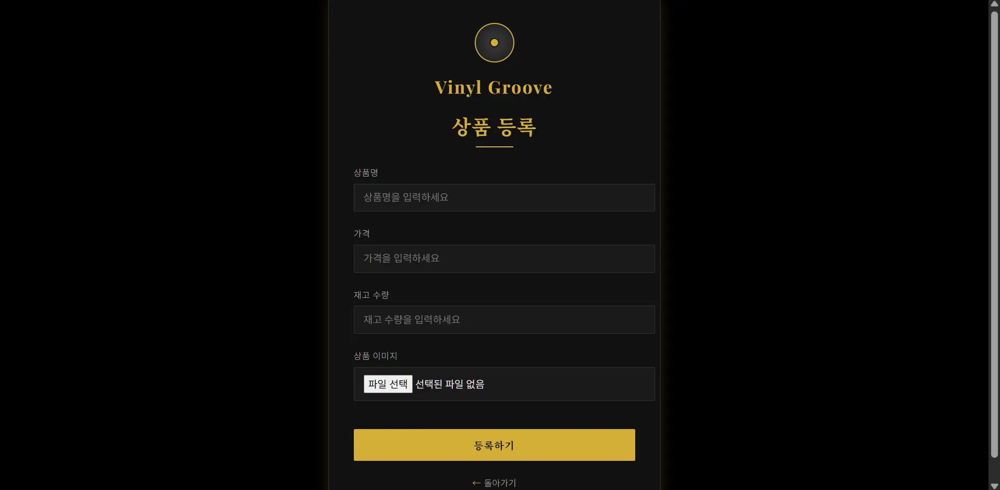
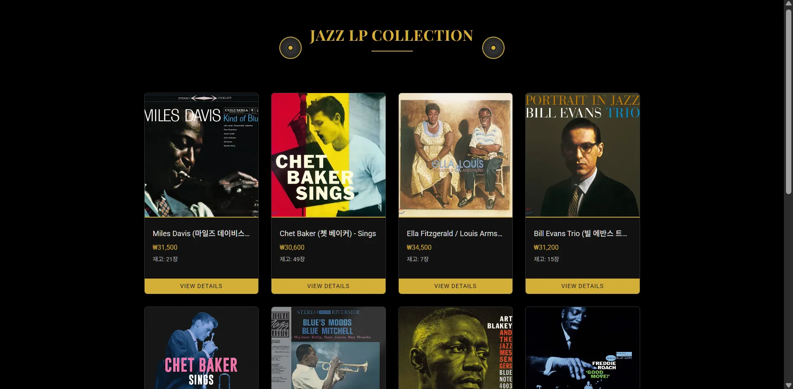
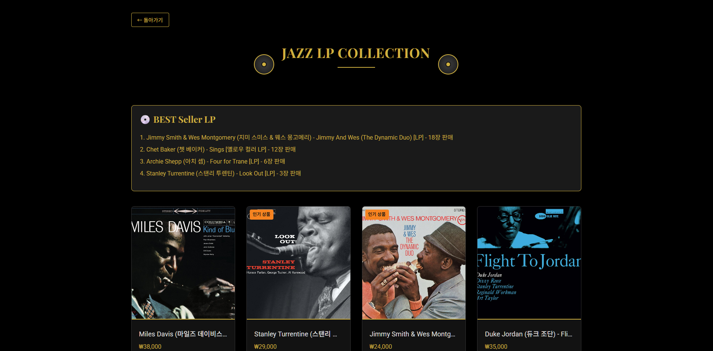
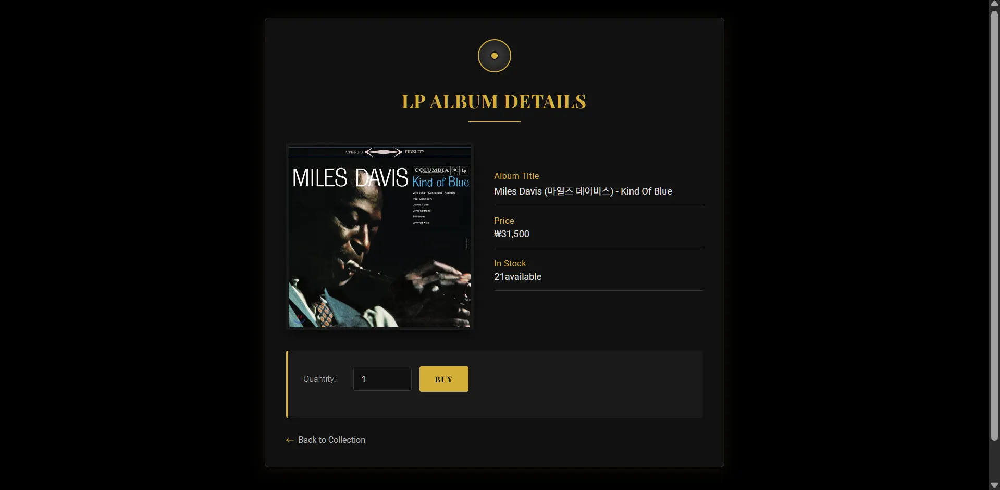
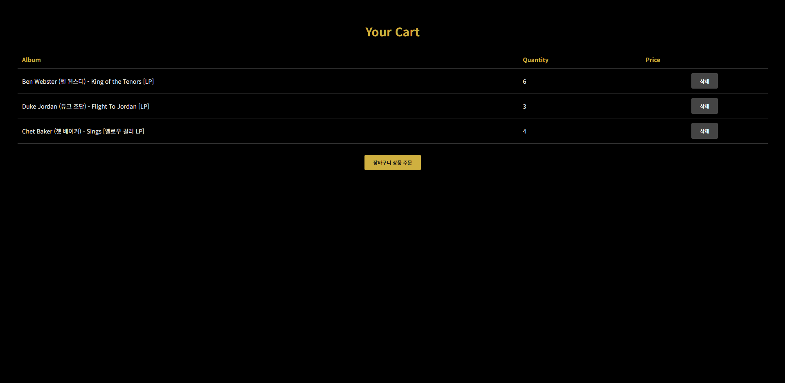
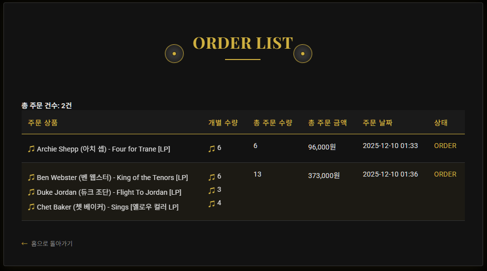
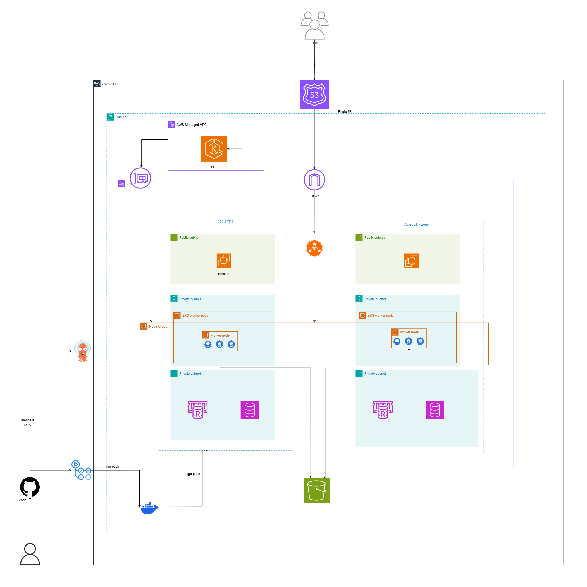

# 💿 Vinyl Groove 

<h3 style="margin-top: 0;">🎷 재즈 LP 수집가를 위한 이커머스 플랫폼</h3>

  
   
   
  
  &nbsp;
  

---

## 📋 프로젝트 개요

### **"중고 LP의 성지, Vinyl Groove"**

**Vinyl Groove**는 희귀한 재즈 LP를 탐색하고 구매할 수 있는 이커머스 플랫폼입니다. 단순한 쇼핑몰을 넘어, **대규모 트래픽 상황에서의 동시성 제어**와 **실시간 랭킹 시스템** 등 백엔드 성능
최적화에 집중하여 설계되었습니다.

사용자는 **실시간 인기 앨범**을 확인하고, **Redis 기반의 고속 세션 처리**를 통해 끊김 없는 쇼핑 경험을 즐길 수 있습니다.

---

## 🎯 주요 기능

### 1. 상품 관리 및 S3 이미지 처리

  
  

* **LP 상품 등록/조회**: 관리자는 앨범 커버 이미지를 업로드하고 상품을 등록합니다.
* **AWS S3 연동**: `S3Service`를 통해 이미지 파일을 클라우드 스토리지에 안전하게 저장하고, UUID 기반의 파일명으로 관리하여 중복을 방지합니다.

### 2. 실시간 인기 랭킹 (Redis ZSet)

  

* **실시간 판매량 집계**: 상품 주문 시 Redis의 `Sorted Set(ZSet)`을 활용하여 판매량을 실시간으로 `increment` 합니다.
* **BEST Seller**: `reverseRangeWithScores`를 통해 판매량이 가장 높은 Top 5 앨범을 즉시 조회하여 메인 화면에 노출합니다. DB 부하 없이 실시간 트렌드를 반영합니다.

### 3. 주문 및 동시성 제어 (Redisson)

  

* **재고 관리**: 한정된 수량의 LP를 다수의 사용자가 동시에 주문할 때 발생하는 **Race Condition**을 해결했습니다.
* **분산 락 적용**: `Redisson` 라이브러리를 도입하여 상품 ID(itemId) 기반의 락을 획득, 재고 차감의 원자성을 보장합니다.

### 4. 장바구니 및 주문 내역

  
  

* **장바구니**: 원하는 앨범을 담고, 일괄 주문할 수 있습니다.
* **주문 내역 및 캐싱**: 최근 주문 내역 조회 시 DB 부하를 줄이기 위해 **Redis Caching** 전략(`order:list:member:{id}`)을 적용하여 조회 성능을 개선했습니다.

### 5. 분산 환경 세션 관리

* **Spring Session Redis**: 다중 서버 환경(Scale-out)에서도 로그인 상태가 유지되도록 Redis를 세션 저장소로 활용합니다.
* **동시 로그인 제한**: `UserSessionService`를 통해 동일 아이디의 동시 접속 세션을 제어하고, 보안성을 강화했습니다.

---

## 🏗️ 시스템 아키텍처

Vinyl Groove는 **AWS Cloud** 환경 위에서 **CI/CD 자동화**가 구축된 아키텍처로 설계되었습니다.

    

### ☁️ Infrastructure & Deployment

#### 1. CI/CD Pipeline (GitHub Actions & ArgoCD)

* **GitHub Actions**: 코드 푸시 시 자동으로 빌드 및 테스트를 수행하고, Docker 이미지를 생성하여 Docker Hub에 푸시합니다. (`pipeline.yaml`)
* **ArgoCD**: Kubernetes Manifest 리포지토리(`team1-manifest`)의 변경 사항을 감지하여, 운영 환경(Dev)에 자동으로 배포(GitOps)합니다.

#### 2. Caching & Storage Strategy

* **MySQL (RDS)**: 회원, 상품, 주문 등 핵심 비즈니스 데이터의 영속성 보장.
* **Redis**:
    * **Session Store**: 분산 서버 간 세션 공유.
    * **Cache**: 랭킹(ZSet), 주문 내역(List), 조회수(String) 등 고빈도 조회 데이터 캐싱.
    * **Distributed Lock**: Redisson을 이용한 재고 관리 락.
* **AWS S3**: 앨범 커버 이미지 등 비정형 데이터 저장.

---

## 🛠️ 기술 스택

| Category             | Technology                                                                                                                                                                                                                                                                                                                                                                                                                                                                                                                                                |
|:---------------------|:----------------------------------------------------------------------------------------------------------------------------------------------------------------------------------------------------------------------------------------------------------------------------------------------------------------------------------------------------------------------------------------------------------------------------------------------------------------------------------------------------------------------------------------------------------|
| **Backend**          |                                                                                                              |
| **Database & Cache** |                                                                                                                                                                                                                                                     |
| **Infra & DevOps**   |      |
| **Storage**          |                                                                                                                                                                                                                                                                                                                                                                                                                                                      |

---

## 🚀 고도화 구현 기술 (Advanced Features)

> 본 프로젝트의 핵심적인 기술적 도전과 해결 방안입니다.

### 1. Redisson 분산 락을 이용한 재고 동시성 제어

- **문제:** 인기 LP 발매 시, 다수의 사용자가 동시에 주문 버튼을 누르면 DB의 재고 수량보다 많은 주문이 접수되는 **갱신 손실(Lost Update)** 문제 발생.
- **해결:** `synchronized` 키워드는 다중 서버 환경에서 동작하지 않으므로, **Redis 기반의 분산 락(Redisson)**을 도입.
- **구현:** `OrderService`에서 `redissonClient.getLock("order:item:" + itemId)`를 통해 상품별로 락을 획득. `tryLock`을 사용하여 대기 시간과 락 점유
  시간을 설정함으로써 데드락 방지 및 정합성 보장.

### 2. Redis ZSet을 활용한 실시간 베스트셀러 랭킹

- **문제:** "가장 많이 팔린 상품"을 보여주기 위해 매번 `Order` 테이블 전체를 `count`하고 정렬(Sort)하는 쿼리는 DB에 심각한 부하를 유발함.
- **해결:** **Redis Sorted Set (ZSet)** 자료구조 활용.
- **구현:** 주문 발생 시 `redisTemplate.opsForZSet().incrementScore`로 점수(판매량)를 O(1) 복잡도로 증가시키고, 조회 시 `reverseRangeWithScores`로
  상위 N개를 즉시 반환하여 성능 최적화.

### 3. 조회수 어뷰징 방지 및 최적화

- **문제:** 단순 DB 업데이트 방식의 조회수 카운팅은 I/O 부하가 크고, 새로고침을 통한 어뷰징 공격에 취약함.
- **해결:** **Redis HyperLogLog(또는 Set)와 Expiration** 기능 활용.
- **구현:** `CounterService`에서 사용자 식별자(IP 등)와 게시글 ID를 키로 하여 Redis에 저장하고 TTL(1일)을 설정. 이를 통해 1일 1회 조회수 제한을 메모리 레벨에서 효율적으로
  처리.

---

## 🔥 트러블 슈팅 (Troubleshooting)

<b>1. 분산 환경에서의 세션 불일치 문제</b>

### ❌ 문제 상황

- **현상:** 로드밸런서 뒤에 여러 대의 WAS가 존재할 때, A 서버에서 로그인한 사용자가 B 서버로 요청을 보내면 로그인이 풀리는 현상 발생.
- **원인:** 기본 `HttpSession`은 각 서버의 메모리에 저장되므로 서버 간 공유되지 않음. Sticky Session을 사용할 수 있지만, 특정 서버 부하 집중 문제가 있음.

### 💡 해결 방안

**Spring Session Data Redis 도입**

1. **Redis 중앙화:** 모든 세션 정보를 In-Memory DB인 Redis에 저장하도록 설정.
2. **구현:** `SessionConfig`에 `@EnableRedisHttpSession` 어노테이션을 적용하여, 별도의 비즈니스 로직 수정 없이 투명하게 분산 세션 환경 구축.
3. **성과:** 서버가 아무리 늘어나도 사용자의 로그인 상태가 일관되게 유지됨.

<b>2. 재고 감소 로직에서의 동시성 이슈와 락 타임아웃 설정</b>

### ❌ 문제 상황

- **현상:** Redisson 락을 적용했음에도, 락을 획득하지 못한 요청들이 예외를 던지며 주문 실패 처리됨. 사용자는 "시스템 오류"로 인식.
- **원인:** 락 획득 대기 시간(`waitTime`)을 너무 짧게 설정하여, 앞선 트랜잭션이 끝나기도 전에 타임아웃이 발생함.

### 💡 해결 방안

**적절한 WaitTime/LeaseTime 설정 및 재시도 로직 검토**

1. **설정 값 튜닝:** `tryLock(5, 10, TimeUnit.SECONDS)`와 같이 대기 시간을 5초로 늘려, 트래픽이 몰려도 순차적으로 처리될 수 있는 여유를 확보.
2. **UX 개선:** 락 획득 실패 시 단순 에러가 아닌 "잠시 후 다시 시도해주세요"라는 명확한 메시지를 전달하거나, 내부적으로 소폭의 딜레이 후 재시도하는 로직 고려.

---

## 👥 팀원 및 역할

<table>
  <tr>
    <td align="center" width="33%">
      
      <h3 style="margin-top: 10px;">허준형</h3>
      <b>👑 Team Leader</b>
    </td>
    <td align="center" width="33%">
      
      <h3 style="margin-top: 10px;">정영민</h3>
      <b>🥈 Vice Team Leader</b>
    <td align="center" width="33%">
      
      <h3 style="margin-top: 10px;">김종훈</h3>
      <b>Team Member</b>
    </td>
  </tr>
  <tr>
    <td align="center" width="33%">
      
      <h3 style="margin-top: 10px;">임현주</h3>
      <b>Team Member</b>
    </td>
    </td>
    <td align="center" width="33%">
      
      <h3 style="margin-top: 10px;">조성민</h3>
      <b>Team Member</b>
    </td>
  </tr>
</table>